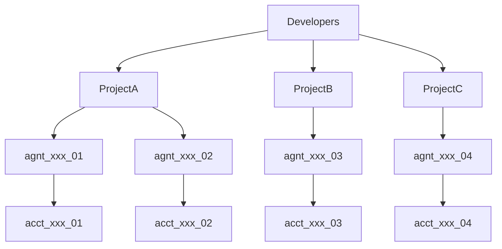

To help developers understand how tLedger structures different layers of objects, here's a brief overview of the hierarchy:



## Project

A project serves as the top-level financial and operational container, grouping agent collections, financial accounts, API keys, risk limits, billing information, and other resources.

If you are working with different teams or clients, you can create separate projects to segregate sensitive information and tool access. We recommend that each project represents one standalone business use case—for example, a 'travel planning' project to organize travel planning agents versus a 'car rental' project for car rental agents.

Each project includes a **treasury agent** to manage overall funds on behalf of the project owner (agent companies or developers). All other agent instances are **autonomous agents**, each with their own t54 financial account representing third-party end users.

Project management is exclusively accessible through **tPortal**, our web-based dashboard for developers.

## Agent (Financial Profile)

An Agent represents a financial identity for an individual AI agent. Each agent belongs to one Project, and each **autonomous** agent represents one instance that should be initiated and connected with a human user. Autonomous agents typically carry out actions for humans, while **treasury agents** serve the special purpose of managing project treasury funds.

Each agent maintains a daily transaction limit and associated multi-asset accounts.

**Important Note:** t54 does not host AI agents but empowers them with financial capabilities. The term "agents" in t54 refers to the financial profile and associated financial capabilities—effectively the financial identity of the AI agent.

## Account

A virtual account is linked to an agent and holds a specific asset (e.g., SOL, USDT) on a specific network. It functions as a virtual account for the agent, meaning agents don't initiate payments directly from their asset accounts, but from their agent profile account using their agent ID `agnt_xxx`. tLedger automatically manages different networks and currencies across various asset accounts and synchronizes with the blockchain ledger.

For information about currently supported blockchain networks, visit our [Supported Chains documentation](https://docs.t54.ai/v1.2/update/docs/supported-chains#/).

## Example Agent Object

Below is a sample agent object with associated asset accounts:

```json
{
    "agent": {
        "object": "agent",
        "id": "agnt_95dcc7bb-dcc1-435a-a5c9-5e85ac57a4c5",
        "project_id": "proj_c2b29e30-f2ab-4bbf-9d18-ab7d6c9aafb5",
        "name": "Crypto Agent 8582e62b",
        "agent_description": "Professional crypto agent focusing on financial operations",
        "agent_type": "autonomous_agent",
        "created_at": "2025-06-21T20:43:59.557980",
        "updated_at": "2025-06-21T20:43:59.557985",
        "daily_limit": 100.0,
        "project": "/api/v1/projects/proj_c2b29e30-f2ab-4bbf-9d18-ab7d6c9aafb5"
    },
    "account": [
        {
            "object": "account",
            "id": "acct_efc8dd97-2a7e-4df1-92f0-51449faa1394",
            "owner_id": "d52768ec-9cc0-4547-a15e-1ff2f4cae448",
            "balance": 10.0,
            "asset": "SOL",
            "wallet_address": "9XEujVEA4mXLQLAJ88PfF9QdXnEFTssrsXtWR5yrjYsC",
            "network": "SOLANA",
            "is_testnet": true,
            "account_metadata": "{}",
            "created_at": "2025-06-21T20:43:59.496259",
            "updated_at": "2025-06-21T20:43:59.496262"
        },
        {
            "object": "account",
            "id": "acct_1007738d-3ecf-45ca-85f7-b140b91c760b",
            "owner_id": "d52768ec-9cc0-4547-a15e-1ff2f4cae448",
            "balance": 0.0,
            "asset": "USDT",
            "wallet_address": "GJF6xjbW62v3NMwrrTKLuq86cw9DDeJfDVETCfe84dxf",
            "network": "SOLANA",
            "is_testnet": true,
            "account_metadata": "{\"mint_id\": \"EJwZgeZrdC8TXTQbQBoL6bfuAnFUUy1PVCMB4DYPzVaS\", \"decimals\": 6}",
            "created_at": "2025-06-21T20:43:59.511190",
            "updated_at": "2025-06-21T20:43:59.511198"
        },
        {
            "object": "account",
            "id": "acct_3b5da8c8-23ef-42ba-ac91-8cd1a8c81d7e",
            "owner_id": "d52768ec-9cc0-4547-a15e-1ff2f4cae448",
            "balance": 0.0,
            "asset": "USDC",
            "wallet_address": "6eUWuHVEBpu9ANbqV9GKq9KdLABhdqeaEM16WgydtcVV",
            "network": "SOLANA",
            "is_testnet": true,
            "account_metadata": "{\"mint_id\": \"4zMMC9srt5Ri5X14GAgXhaHii3GnPAEERYPJgZJDncDU\", \"decimals\": 6}",
            "created_at": "2025-06-21T20:43:59.517932",
            "updated_at": "2025-06-21T20:43:59.517941"
        },
        {
            "object": "account",
            "id": "acct_434361e2-228d-4aca-9662-2abf4474ff68",
            "owner_id": "d52768ec-9cc0-4547-a15e-1ff2f4cae448",
            "balance": 10.0,
            "asset": "XRP",
            "wallet_address": "rDQAqAGLrwbPDHjPWQqMwV1WttDHALigAD",
            "network": "XRPL",
            "is_testnet": true,
            "account_metadata": "{}",
            "created_at": "2025-06-21T20:43:59.541929",
            "updated_at": "2025-06-21T20:43:59.541931"
        },
        {
            "object": "account",
            "id": "acct_9b4a5dde-885f-4acf-9756-d2dc0b49cb5b",
            "owner_id": "d52768ec-9cc0-4547-a15e-1ff2f4cae448",
            "balance": 10.0,
            "asset": "RLUSD",
            "wallet_address": "rDQAqAGLrwbPDHjPWQqMwV1WttDHALigAD",
            "network": "XRPL",
            "is_testnet": true,
            "account_metadata": "{}",
            "created_at": "2025-06-21T20:43:59.547890",
            "updated_at": "2025-06-21T20:43:59.547893"
        }
    ]
}
```