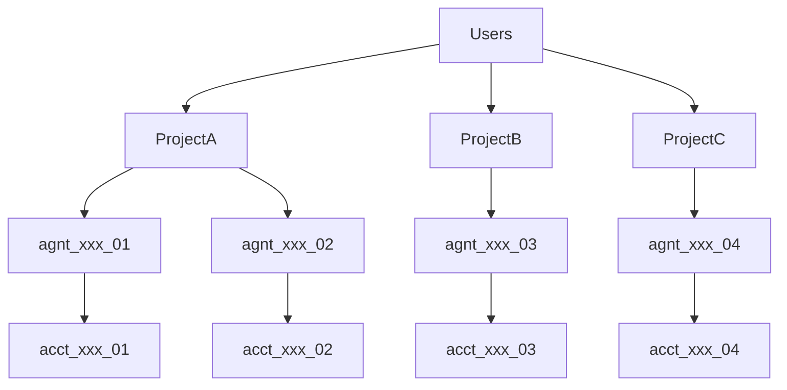

To help developers understand how tLedger structures different layer of objects, here's a brief overview of the hierarchy:



## Project

A project is a group of agent collections, financial accounts, API keys, risk limit, billing information, and more. It acts as the top-level financial and operational container.

If you are working with different teams or clients, you can create different projects to segregate sensitive information and tool access. We recommend each project represent one standalone business use case, for example, a 'travel planning' project to organize a group of travel planning agents vs 'car rental' project to organize a group of car rental agents

Each project includes a **treasury agent** to manage the overall fund on behalf of the project owner (Agent company, developers). And all the other instances of agent will be **autonomous agent**, each autonomous agent have its own t54 financial account, representing the third party end human user.

Project management can only be accessed through **tPortal**, our web based dashboard for developers.

## Agent (Financial Profile)

An Agent represents a financial identity for an individual AI agent. Each agent belongs to one Project. And each **autonomous** agent represents one \*\*instance \*\*which should be initiated and connected with a human user. Autonomous agents usually carry out actions for humans.  **Treasury agents** serve a special case to manage project own treasury funds.

Each agent will also have a daily transaction limit and associated multi-asset accounts.

Note: t54 labs don't host AI agents, but empower AI agents with financial capability. The **agents** term in t54 labs represent the financial profile and its associated financial capability, effectively the financial profile of the AI agent.

## Account

A virtual account is linked to an agent and holds a specific asset (e.g., SOL, USDT) on specific network. It functions as a virtual account to the agent, which means agent doesn't initiate payment from any of their asset account, but from their agent profile account - their agent id 'agnt\_xxx'. tLedger will automatically manage different networks and different currencies across different asset accounts and sync with the blockchain ledger.

This is a sample of an agent object with asset accounts:

```json json
{
   "agent":{
      "object":"agent",
      "id":"agnt_95dcc7bb-dcc1-435a-a5c9-5e85ac57a4c5",
      "project_id":"proj_c2b29e30-f2ab-4bbf-9d18-ab7d6c9aafb5",
      "name":"Crypto Agent 8582e62b",
      "agent_description":"Professional crypto agent focusing on financial operations",
      "agent_type":"autonomous_agent",
      "created_at":"2025-05-19T13:57:23.354234",
      "updated_at":"2025-05-19T13:57:23.354234",
      "daily_limit":100.0,
      "project":"/api/v1/projects/proj_c2b29e30-f2ab-4bbf-9d18-ab7d6c9aafb5"
   },
   "account":[
      {
         "object":"account",
         "id":"acct_2d95f75c-b908-455e-87b4-157f4d20eca2",
         "owner_id":"c4eaf2b4-7de1-4146-8fbe-4bc1bc932338",
         "balance":100.0,
         "asset":"XRP",
         "wallet_address":"rpp8XNAv5aCCY99p3WQQQpLQyW8E6eG2EF",
         "network":"xrpl",
         "is_testnet":true,
         "account_metadata":"{}",
         "created_at":"2025-05-19T13:57:23.800900",
         "updated_at":"2025-05-19T13:57:34.570399"
      },
      {
         "object":"account",
         "id":"acct_9fbc8300-9273-4750-b843-82b6839f9f5d",
         "owner_id":"c4eaf2b4-7de1-4146-8fbe-4bc1bc932338",
         "balance":0.02,
         "asset":"SOL",
         "wallet_address":"FEfv1x5aYmtHLHGMSiXgfqchf1CPNo3BTYdqYCxcvvs7",
         "network":"solana",
         "is_testnet":true,
         "account_metadata":"{}",
         "created_at":"2025-05-19T13:57:23.785866",
         "updated_at":"2025-05-19T13:57:50.226970"
      }
   ]
}
```