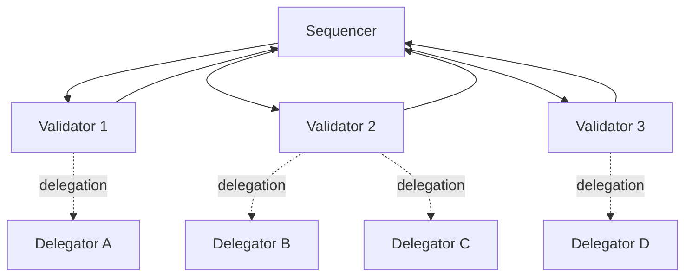

## Layered Security with Validator Agents

tRadar’s architecture is **multi-layered** by design, with each layer providing an increasing level of scrutiny and intelligence. At a high level, it consists of the following components and layers:

 

* **Rule-Based Pre-Screening**: A lightweight **rule engine** performs initial checks on every transaction. These rules codify straightforward risk controls – for example, enforcing transaction size limits based on an agent’s trust level or daily quotas, checking frequency of transactions, and recognizing known suspicious patterns. Simple heuristics can automatically flag or reject obviously risky transactions (e.g. amounts exceeding project-defined daily limits) and auto-approve trivial low-risk ones. This ensures clearly safe transactions proceed without delay, and clearly dangerous ones are stopped early, reducing the load on deeper layers.

  The rule engine in tRadar also encapsulates behavior-based rules; it can analyze an agent’s function call stack and context to detect anomalous behavior patterns. For instance, if a normally low-privilege agent suddenly attempts a large transfer outside its usual scope, a rule might mark it as high risk. By filtering out the extremes, this layer allows subsequent validators to focus on the truly ambiguous **medium-risk** cases.

 

* **Validator-Agent Network (VAN)**: Transactions that are not outright approved or rejected by rules enter the **Validator-Agent Network** layer for rigorous analysis. The VAN is a network of independent **validator agents**, each implemented as an AI (potentially powered by different foundational models like GPT-4, Claude, DeepSeek, etc.). Each validator agent receives the transaction details and rich context and performs a thorough risk assessment using advanced reasoning.

  Notably, tRadar provides validators with the full **trace context** of the initiating agent – essentially a snapshot of the agent’s thoughts, function/tool calls, and decision process leading up to the payment. This means *validators don’t just see “Agent A wants to send $100 to B”; they also see why the agent is doing this, what steps it took, and whether it used audited, trusted functions to initiate the payment* (via **function call stack hashes** that are cross-checked with the tAudit code audit records). All this information helps the validator agents to reason about the transaction’s legitimacy in a human-like way. One validator might simulate the agent’s reasoning to spot inconsistencies, while another might apply a different model with its own perspective – this diversity makes the system more robust.

 

* **Sequencer (Task Orchestrator)**: At the heart of the VAN is the **Sequencer**. The sequencer is a coordinating service that routes each transaction (after pre-screening) to the validator agents, manages the flow of information, and aggregates their responses. When a new payment request arrives, the sequencer packages the relevant data\_ (transaction details, context, rule-engine outcome, etc.)\_ and dispatches it to all active validators in parallel. It assigns a unique task ID and perhaps a time window for responses. The validators perform their analysis and return their verdicts. The sequencer then **aggregates these results** using a consensus algorithm. Importantly, not all validators are treated equal – each has a certain **weight** in the voting based on its reliability and stake (more on this in the next section). The sequencer computes the weighted outcome to decide the network’s overall verdict on the transaction.

  For example, if the majority (by weight) of validators approve and none raises a critical objection, the transaction is deemed safe. If a significant subset flags the transaction as risky, the sequencer can escalate the review (e.g. trigger a challenge). In essence, the sequencer functions like a moderator: it ensures each transaction is examined by multiple eyes, and it coordinates the consensus that determines whether the transaction passes or not. Currently, the sequencer is implemented as a service within the t54 platform for efficiency, but there are plans to decentralize this function in the future.

 

* **Consensus and Decision Layer**: The combination of the validator agents’ analysis, weighted voting, and sequencer logic forms tRadar’s consensus layer. This is where a final risk decision is made for each transaction.

  tRadar classifies risk into tiers – for instance, **LOW** risk transactions can be auto-approved, whereas **CRITICAL** risk transactions are automatically rejected. **MEDIUM** and **HIGH** risk cases undergo additional scrutiny: if the validators collectively still have uncertainty or split opinions, tRadar can issue a challenge asking for more information. **This challenge mechanism is a powerful feature of tRadar: rather than outright rejecting a suspicious transaction, the system may pause it and request clarifications or evidence from the originating agent** .

  For example, validators might want to confirm the purpose of a large transfer,  and it can be achieved simply by agent-to-agent communication. The transaction is only allowed to proceed if the additional info satisfies the validators upon re-evaluation. This layered escalation – from automated rules to dynamic multi-agent reasoning to **interactive challenges** – ensures a balance between security and usability. Legitimate transactions can still go through (perhaps after responding for a few challenges by the payer agent), while truly malicious ones are stopped at one of the layers.

 

* **Data Logging and Audit Trail**: Every step of this process is logged in t54’s backend for transparency and future analysis. Key tables include the Payment table (recording each transaction’s details and outcome) and the Risk Assessment table (logging the risk level, reasoning, and decision for each validation). These logs create an audit trail that developers, partners, or regulators can review to see why a particular transaction was flagged or allowed. The inclusion of **tAudit**(the code auditing service) further strengthens this auditability – by linking **function call hashes** in the transaction record to pre-audited code, tRadar can demonstrate that only approved code paths were used to initiate payments. The synergy between tAudit and tRadar means the platform not only evaluates the transaction’s context but also verifies the integrity of the agent code involved, establishing a chain of trust from code to transaction execution.

 

The result of this architecture is a **defense-in-depth** for agent initiated transactions: simple known threats are caught by rules, complex or novel threats are examined by multiple reasoning engines (validator agents) working together, and ambiguous cases trigger a feedback loop for more information. All of this happens in real-time and fully autonomous, so from a user’s perspective, tRadar is an active guardian that transparently checks transactions with much faster operations. It provides a safety net that is both **intelligent** (thanks to AI validators) and **systematic** (thanks to structured rules and consensus protocols).

To visualize how these components relate to each other, consider the diagram below showing tRadar’s validator network structure and roles:

*Diagram*: *The Validator-Agent Network in tRadar.*

The **Sequencer** coordinates the process, sending each transaction to a committee of **Validators** (Validator 1, 2, 3) for analysis and receiving their results. Each validator agent operates independently (often using diverse LLM models) to evaluate the transaction. **Delegators** (A, B, C, D) are stakeholders who delegate stake to validators (shown by dashed “delegation” links), increasing those validators’ weight in the consensus. Validators with more delegated stake (or better performance history) exert more influence on decisions. The sequencer tallies the validators’ weighted votes to reach a final decision for the transaction. (For clarity, validator-to-sequencer result returns and one-to-many delegator relationships are depicted; actual network may include many validators and delegators.)