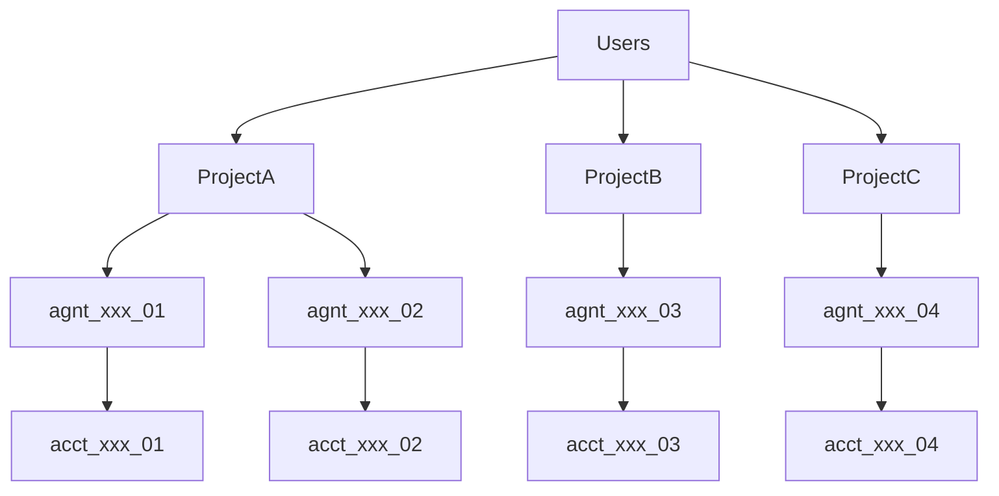

This page provides a high-level walkthrough of the most important tLedger API endpoints and how they map to common agent workflows. For full schema details and exhaustive endpoint documentation, please refer to the [API Reference](https://docs.t54.ai/reference/payment-create_payment#/).

<br />

# Authentication

All API requests must include the following headers:

```
X-API-Key: your_api_key
X-API-Secret: your_api_secret
```

API keys are tied to only one project, its scope is also under the specified project, including all agent instances under this project. API keys can only be generated from the tPortal manually (Coming Soon).

<br />

# Base URL

**sandbox environment**: [http://api-sandbox.t54.ai/api/v1](http://api-sandbox.t54.ai/api/v1)

**production environment**: [http://api.t54.ai/api/v1](http://api.t54.ai/api/v1)

<br />

# System Hierarchy

To help developers understand how tLedger structures different layer of objects, here's a brief overview of the hierarchy:

<br />



<br />

## Project

A Project acts as the top-level financial and operational container, created by developers or companies. Project represents an agent with specific functions, but not an instance of the agent, like a travel plan agent, should be seen as a 'Project'.

Each project includes a **treasury agent** to manage the overall fund. And all the other instances of agent will be **autonomous agent**.  Treasury Agent and Autonomous Agent are the only two type of agents so far.

Centralized configuration including a high level daily transaction limit set by the developer.

Project management can only be accessed through **tPortal**, our web based dashboard for developers.

<br />

## Agent (instance)

An Agent Represents a financial identity for an individual AI agent. Each agent belongs to one Project. And each agent represents one \*\*instance \*\*which should be initiated and connected with a human user.

Treasury agents manage project funds; autonomous agents carry out actions.

Each agent will also have a daily transaction limit (set by the creator) and associated multi-asset accounts.

<br />

## Asset Account

An asset account is linked to an agent and holds a specific asset (e.g., SOL, USDT) on specific network. It functions as a virtual account to agent, which means agent doesn't initiate payment from any of their asset account, but from their agent profile account - their agent id 'agt\_xxx'. tLedger will automatically manage different networks and different currencies accross different asset accounts and sync with the blockchain ledger.

This is a sample of an agent object with asset accounts:

```json json
{
   "agent":{
      "object":"agent",
      "id":"agnt_95dcc7bb-dcc1-435a-a5c9-5e85ac57a4c5",
      "project_id":"proj_c2b29e30-f2ab-4bbf-9d18-ab7d6c9aafb5",
      "name":"Crypto Agent 8582e62b",
      "agent_description":"Professional crypto agent focusing on financial operations",
      "agent_type":"autonomous_agent",
      "created_at":"2025-05-19T13:57:23.354234",
      "updated_at":"2025-05-19T13:57:23.354234",
      "daily_limit":100.0,
      "project":"/api/v1/projects/proj_c2b29e30-f2ab-4bbf-9d18-ab7d6c9aafb5"
   },
   "account":[
      {
         "object":"account",
         "id":"acct_2d95f75c-b908-455e-87b4-157f4d20eca2",
         "owner_id":"c4eaf2b4-7de1-4146-8fbe-4bc1bc932338",
         "balance":100.0,
         "asset":"XRP",
         "wallet_address":"rpp8XNAv5aCCY99p3WQQQpLQyW8E6eG2EF",
         "network":"xrpl",
         "is_testnet":true,
         "account_metadata":"{}",
         "created_at":"2025-05-19T13:57:23.800900",
         "updated_at":"2025-05-19T13:57:34.570399"
      },
      {
         "object":"account",
         "id":"acct_9fbc8300-9273-4750-b843-82b6839f9f5d",
         "owner_id":"c4eaf2b4-7de1-4146-8fbe-4bc1bc932338",
         "balance":0.02,
         "asset":"SOL",
         "wallet_address":"FEfv1x5aYmtHLHGMSiXgfqchf1CPNo3BTYdqYCxcvvs7",
         "network":"solana",
         "is_testnet":true,
         "account_metadata":"{}",
         "created_at":"2025-05-19T13:57:23.785866",
         "updated_at":"2025-05-19T13:57:50.226970"
      }
   ]
}
```

Multiple accounts can share the same blockchain wallet address within a network.

<br />

# Key Endpoints

Please refer to the [API Reference](https://docs.t54.ai/reference/payment-create_payment#/) for detailed input/output.

<br />

## Onboard a new Agent

```
POST /api/v1/agent_profiles
```

Registers an AI agent under a project.

Sample response:

```json JSON
{
   "object":"agent",
   "id":"agnt_65d5f218-8189-478e-b77a-7ce0031dcdae",
   "project_id":"proj_c2b29e30-f2ab-4bbf-9d18-ab7d6c9aafb5",
   "name":"Wallet Agent 38738798",
   "agent_description":"Advanced wallet agent handling digital currency tasks",
   "agent_type":"autonomous_agent",
   "created_at":"2025-05-21T15:20:46.251861",
   "updated_at":"2025-05-21T15:20:46.251861",
   "daily_limit":100.0,
   "account":[
      {
         "object":"account",
         "id":"acct_1eb4e278-e760-4617-8b0a-42d41fe827d2",
         "owner_id":"b4963292-b207-4117-8383-5f9e6a46e6b9",
         "balance":0.0,
         "asset":"SOL",
         "wallet_address":"Fvjbzqm4Uz9kqEFnMNUCzw1rAUqeDA5XLqBJ9efRmAPp",
         "network":"solana",
         "is_testnet":true,
         "account_metadata":"{}",
         "created_at":"2025-05-21T15:20:46.222860",
         "updated_at":"2025-05-21T15:20:46.222860"
      },
      {
         "object":"account",
         "id":"acct_0a759e3f-384d-4f2b-817c-f1d0ee9511e2",
         "owner_id":"b4963292-b207-4117-8383-5f9e6a46e6b9",
         "balance":0.0,
         "asset":"XRP",
         "wallet_address":"rnnK7ePj4E4bFn6W21Jjhum9XrNtMbLQrp",
         "network":"xrpl",
         "is_testnet":true,
         "account_metadata":"{}",
         "created_at":"2025-05-21T15:20:46.243860",
         "updated_at":"2025-05-21T15:20:46.243860"
      }
   ]
}
```

<br />

## Initiate a Payment

```
POST /api/v1/payment
```

Sends funds from one agent to another. Use this to trigger payments between agents via tLedger.

Sample response:

```json
{
   "object":"payment",
   "id":"pymt_b70a2703-1e61-43ac-a686-f23230fb54eb",
   "status":"initiated",
   "payment_amount":1.0,
   "sending_agent_id":"agnt_19cebeaf-c961-4e50-a132-c0b39a8ecc55",
   "sending_agent_name":"Blockchain Agent 6021a23a",
   "receiving_agent_id":"agnt_95dcc7bb-dcc1-435a-a5c9-5e85ac57a4c5",
   "receiving_agent_name":"Crypto Agent 8582e62b",
   "settlement_network":"xrpl",
   "currency":"XRP",
   "transaction_fee":0.0,
   "transaction_hash":"",
   "created_at":"2025-05-21T15:08:13.476287",
   "updated_at":"2025-05-21T15:08:13.476287",
   "request_id":"a0d89ec9-cf3b-44f0-97db-2e580d92a79c",
   "error_details":null,
   "challenge":null,
   "risk_level":"low",
   "debug_mode":false
}
```

<br />

## Retrieve Agent Details

```
GET /api/v1/agent_profiles/{agent_id}
```

Fetches agent metadata, virtual accounts, balances, and limits.

<br />

## Monitor Agent Balance

```
GET /api/v1/balance/agent/{agent_id}
```

Get the balance information of a specifid agent.

Sample response:

```json JSON
{
   "agent_id":"agnt_19cebeaf-c961-4e50-a132-c0b39a8ecc55",
   "total_balance_usd":241.4092,
   "balances_by_asset":{
      "XRP":100.0,
      "SOL":0.02
   },
   "usd_balances_by_asset":{
      "XRP":238.0,
      "SOL":3.4092000000000002
   }
}
```

<br />

# Full Reference

Looking for full request/response schemas, status codes, and examples?

Visit the [API Reference](https://docs.t54.ai/reference/payment-create_payment#/) for complete documentation.