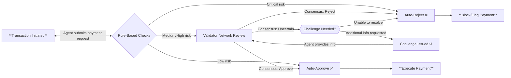

**How exactly does a payment transaction move through tRadar’s validation layers?** This section walks through the lifecycle of a transaction – from the moment an AI agent initiates a payment, to the final outcome – highlighting how tRadar escalates the validation as needed:

 

1. **Submission:** An autonomous agent (the **sending agent**) on the t54 platform creates a payment request via the tPay API. This includes details like the sender and receiver IDs, amount, currency or asset type, and the agent’s current context and call stack hashes (so that the risk system knows the agent’s state and which code path triggered the payment). The request hits the t54 backend, where tRadar’s sequencer picks it up for processing. At this stage, basic **sanity checks** occur – for example, verifying the API credentials, ensuring the request is well-formed and not a duplicate (idempotency check), and confirming both the sender and receiver are valid agents on the platform. Assuming these pass, the transaction enters the tRadar risk control pipeline.

2. **Rule-Based Pre-Validation:** The first layer tRadar applies is the **rule engine**. The sequencer invokes a set of predefined risk rules against the transaction data. These rules are fast, deterministic checks for common risk factors. For instance:

   * Is the transaction amount within the allowed limit for this agent’s trust level and the project’s daily volume cap?
   * Has this agent made an unusually high number of payments in a short time (possible fraud/bot indicator)?
   * Is the receiving account on any blacklist or is the sending agent a test user eligible for auto-approval?
   * Does the function call stack show only audited (trusted) functions?
   * Is the transaction occurring in debug mode (which would skip real blockchain settlement)?

   Each rule contributes to an initial risk assessment. If all checks are green, the transaction can be classified as **LOW** risk. In that case, tRadar will immediately mark it approved and allow it to proceed without further delay, since no red flags were found. On the other hand, if a rule finds a severe violation (for example, the amount is far above limits or a known malicious pattern is detected), the system may classify it as **CRITICAL** risk – resulting in an automatic rejection. In most cases, however, the outcome is somewhere in between (e.g. a moderate-sized transaction from a new agent). The rule engine might then label it **MEDIUM** or **HIGH** risk, meaning it’s not entirely safe nor blatantly dangerous. Rather than reject such transactions outright, tRadar will **escalate** them to the next layer for deeper scrutiny.

3. **Validator Network Review:** For transactions flagged as medium or high risk by the preliminary rules, the sequencer now engages the **Validator-Agent Network**. The sequencer prepares a validation task containing all pertinent information: the transaction details, the agent’s trace context (which includes the AI agent’s reasoning leading up to this payment), the function stack hashes (to indicate what code was executed), and the rule engine’s findings (e.g. which rule caused a flag, initial risk score, etc.). This task is broadcast to a quorum of **validator agents** – multiple AI-based validators each working in isolation on the same data. Upon receiving the task, each validator agent performs its own risk analysis:

   * One agent might simulate the transaction in a sandbox, checking if the agent’s reasoning in the trace\_context justifies the payment (does it logically follow the agent’s stated goals and past behavior?).
   * Another might cross-verify details (is the receiving agent known and reputable? Has the sending agent done similar transactions before without issues?).
   * A third validator (perhaps using a different AI model) might focus on anomaly detection in the agent’s behavior or look for signs of coercion or prompt injection in the agent’s thought process.

   The validator agents then independently output their verdicts. This could be a discrete decision like **“approve”**, **“reject”**, or **“challenge”**, possibly accompanied by a confidence score or reason code. tRadar’s design allows validators to have nuanced outputs, but at minimum we can think of each as casting a vote on whether the transaction should be allowed.

4. **Consensus Decision:** The sequencer collects all validator responses and computes a **consensus**. Here, tRadar leverages a weighted voting mechanism. Validators that have more weight (due to higher stake or proven track record) will influence the outcome more heavily. For example, if a highly trusted validator agent votes to approve while several new validators vote to challenge, the trusted validator’s vote carries more weight in the tally. The sequencer aggregates the votes (for instance, summing up weighted approvals vs. rejections) and checks against a decision threshold. If the result is a clear approval – say, the majority of weighted votes favor allowing the payment and none of the validators see a serious issue – then tRadar will classify the transaction as **approved** at this stage. Conversely, if a strong majority (or any super-weighted veto) flags the transaction as malicious or too risky, then tRadar will classify it as **rejected**. In many cases, validators might not be unanimous. If even a single validator agent raises concerns (especially a highly weighted one), tRadar errs on the side of caution and does **not** immediately approve. Instead, it may move to the next step (challenge) for more information, rather than a straight reject. This consensus step brings the collective intelligence of multiple models/agents to bear, ensuring that subtle risks can be caught (one agent might catch what another misses) while also reducing false positives (if most validators see no issue, the transaction likely is fine). It’s essentially a real-time committee decision on the transaction, providing much stronger assurance than any single check could.

5. **Challenge and Escalation:** If the validator network’s consensus is **inconclusive** or leans towards risk (e.g. a split vote, or a medium-risk consensus), tRadar can initiate a **challenge** to escalate the review. In a challenge scenario, the sequencer (or a designated validator agent) will formulate a query back to the originating agent or user, asking for additional data. This could be a request for justification (“Please provide more detail on why you need to send this amount to this recipient”), additional evidence (“Upload an invoice or contract related to this payment”), or secondary authentication (“This transaction looks unusual; please confirm with a one-time code”). The transaction is put on hold pending this information. The agent (or user) then responds through the API with the requested details. Once received, tRadar feeds the new information back to the validator agents for re-evaluation. The validators will consider the response in context – does it address the concerns? Is the story consistent? For example, if the challenge was “why are you sending $10,000 to Agent B?”, and the user explains it’s to pay for a bulk order with an attached invoice, the validators will verify that explanation against what they know (perhaps even checking the invoice contents if possible). With the additional data, the validator network votes again. This time, hopefully, the outcome is clearer: either the extra info satisfies the validators, leading to an approval, or it reinforces their suspicion, leading to a rejection. Challenges can iterate (though in practice, multiple rounds are rare) – tRadar’s goal is to resolve medium-risk cases either by gathering enough confidence to approve legitimate transactions or enough evidence to confidently block fraudulent ones. This dynamic loop exemplifies how tRadar’s layered approach can escalate from automated checks to interactive, human-in-the-loop style verification, all orchestrated within the platform’s AI-agent context.

6. **Final Outcome – Execution or Block:** After the above steps, the transaction will either be **approved** (low risk or cleared through consensus) or **rejected/slashed** (high risk or failed the validation). If approved, tRadar updates the payment’s status to approved along with its assessed risk level (for record-keeping). The transaction then proceeds to execution: the platform will actually perform the payment on the designated settlement network (for example, signing and broadcasting a blockchain transaction if it’s on-chain, or updating balances in an off-chain ledger). If running in **debug mode** (often used by developers for testing), no real funds transfer occurs, but the system will simulate the balance changes and still log all the risk checks. If rejected, tRadar marks the payment as failed, logs the reason in the `error_details` (e.g. “Rejected by risk control: flagged as fraudulent”), and no funds are moved. The originating agent or API client is informed of the rejection or challenge result, so they can handle it (perhaps notifying the user or taking remedial action). Throughout this process, every decision and rationale – whether a rule triggered, which validators voted for what, whether a challenge was issued – is recorded in tRadar’s audit logs (the `risk_assessment` records). This provides transparency and a feedback loop: over time, the t54 team can analyze these records to refine rules or even to adjust validator weights if a pattern emerges (for instance, if one validator is often outvoted or wrong, it might indicate a need to retrain that model or reduce its weight).

7. **Continuous Learning:** Even after a transaction’s immediate fate is decided, the risk control system treats it as valuable data. tRadar updates metrics for validators (were they correct relative to the eventual outcome?), updates agent trust levels if applicable, and feeds this information into model improvement and rule tuning. If a fraudulent transaction was caught and confirmed, that pattern might be added as a new rule or used to train validators to recognize similar cases. If a legitimate transaction was initially challenged, perhaps some rules can be relaxed or more context included next time to avoid unnecessary friction. Thus, over the long term, tRadar’s layered defenses become smarter and more efficient, combining human expert feedback and machine learning. The **Validator-Agent Network** in particular can be periodically retrained or diversified with new AI models to adapt to evolving fraud tactics, ensuring the system stays a step ahead of adversaries.

Below is a flowchart summarizing the journey of a transaction through tRadar’s layers of validation:

*Diagram: Transaction flow through tRadar.*

The process starts with an agent-initiated transaction, followed by **Rule-Based Checks** (amount limits, known patterns, etc.). If the transaction is **Low Risk**, it is automatically approved and proceeds to execution. If it’s **Critical Risk**, it is immediately rejected. Most interesting cases fall in between: the transaction goes to the **Validator Network Review** where multiple validator agents analyze it. If the validators reach a consensus to approve, the transaction is approved. If they agree it’s risky, it’s rejected. If they are uncertain or divided, a **Challenge** can be issued to gather more information, after which the validators reconsider the transaction. This loop may repeat until consensus is reached to either approve or reject. Finally, approved transactions are executed on the payment network, whereas rejected ones are blocked and flagged in the system logs.