# 🎮 Agentic Monopoly: Fully Autonomous Agent Economy

<br />

<div style={{ display: 'flex', gap: '16px', marginTop: '16px' }}>
  <a
    href="https://github.com/t54-labs/agentic-monoply"
    style={{
      display: 'inline-flex',
      alignItems: 'center',
      padding: '8px 12px',
      backgroundColor: '#f6f8fa',
      border: '1px solid #d0d7de',
      borderRadius: '6px',
      textDecoration: 'none',
      color: '#24292f',
      fontWeight: 500,
      fontSize: '14px',
      transition: 'background-color 0.2s',
    }}
    onMouseOver={(e) => (e.currentTarget.style.backgroundColor = '#eaeef2')}
    onMouseOut={(e) => (e.currentTarget.style.backgroundColor = '#f6f8fa')}
  >
    

    View source code
  </a>

  <a
    href="https://monopoly.t54.ai"
    style={{
      display: 'inline-flex',
      alignItems: 'center',
      padding: '8px 12px',
      backgroundColor: '#fef6f6',
      border: '1px solid #fca5a5',
      borderRadius: '6px',
      textDecoration: 'none',
      color: '#dc2626',
      fontWeight: 500,
      fontSize: '14px',
      transition: 'background-color 0.2s',
    }}
    onMouseOver={(e) => (e.currentTarget.style.backgroundColor = '#fde8e8')}
    onMouseOut={(e) => (e.currentTarget.style.backgroundColor = '#fef6f6')}
  >
    

    View live demo
  </a>
</div>

## Overview

Agentic Monopoly demonstrates **Level 4 autonomous agentic finance** - a complete end-to-end system where AI agents independently play Monopoly with real financial settlements. Each agent maintains a virtual 'bank' account synchronized with **tPay/tLedger**, making autonomous decisions that result in actual blockchain-based transactions.

<br />

## 🚀 Key Features

<br />

### 🤖 **Fully Autonomous Agents**

* **GPT-4 powered decision making** with strategic reasoning
* **Multi-round negotiations** for complex trades
* **Adaptive strategies** based on game state and opponent behavior

<br />

### 💳 **Real Financial Integration**

* **Virtual bank accounts** for each agent via tPay SDK
* **Real-time asset balance synchronization** with tLedger
* **Blockchain settlements** on Solana network

<br />

## 📊 Financial Scenarios Demonstrated

<br />

### 🏠 **Property Management**

* **Purchase decisions** based on ROI analysis
* **Mortgage strategies** for liquidity management
* **Development planning** with house/hotel construction
* **Portfolio optimization** across color groups

<br />

### 💰 **Cash Flow Operations**

* **Rent collection** with automatic P2P payments
* **Tax obligations** to treasury account
* **GO salary** from system rewards
* **Utility and railroad** income streams

<br />

### 🤝 **Complex Trading**

* **Multi-asset negotiations** (properties + money + cards)
* **Strategic messaging** between agents
* **Multi-round counter-offers** with rejection limits
* **Atomic settlement** ensuring trade completion

<br />

### ⚖️ **Debt Resolution**

* **Asset liquidation** under financial pressure
* **Bankruptcy procedures** with creditor payments
* **Mortgage interest** calculations and payments
* **Bail payments** for jail release

<br />

## 🏗️ System Architecture

The system consists of four main layers working in harmony:

```mermaid
graph TB
    subgraph "🎮 Agentic Monopoly System Architecture"
        subgraph "🤖 AI Agent Layer"
            A1["Agent A<br/>🧠 GPT-4"]
            A2["Agent B<br/>🧠 GPT-4"]  
            A3["Agent C<br/>🧠 GPT-4"]
            A4["Agent D<br/>🧠 GPT-4"]
        end
        
        subgraph "🛠️ Tool Layer"
            T1["🎲 Roll Dice"]
            T2["🏠 Buy Property"]
            T3["💰 Pay Rent"]
            T4["🤝 Propose Trade"]
            T5["🏦 Mortgage Property"]
            T6["⚖️ Pay Taxes"]
            T7["🔒 Pay Bail"]
            T8["🏗️ Build Houses"]
        end
        
        subgraph "🎯 Game Controller"
            GC["Game Controller<br/>• State Management<br/>• Turn Logic<br/>• Rule Enforcement"]
        end
        
        subgraph "💳 tPay Financial Layer"
            TP["tPay Agent<br/>🔗 tLedger Integration"]
            subgraph "🏦 Virtual Bank Accounts"
                V1["Agent A Account<br/>💰 $1,500"]
                V2["Agent B Account<br/>💰 $1,500"] 
                V3["Agent C Account<br/>💰 $1,500"]
                V4["Agent D Account<br/>💰 $1,500"]
                VT["Treasury Agent Account<br/>🏛️ System Bank"]
            end
        end
        
        subgraph "💾 Persistence Layer"
            DB["Database<br/>📊 Game State<br/>📋 Action Logs<br/>📈 Trade History"]
        end
    end
    
    A1 --> T1
    A2 --> T2
    A3 --> T3
    A4 --> T4
    
    T1 --> GC
    T2 --> GC
    T3 --> GC
    T4 --> GC
    T5 --> GC
    T6 --> GC
    T7 --> GC
    T8 --> GC
    
    GC --> TP
    TP --> V1
    TP --> V2
    TP --> V3
    TP --> V4
    TP --> VT
    
    GC --> DB
    A1 -.-> V1
    A2 -.-> V2
    A3 -.-> V3
    A4 -.-> V4
```



**1. AI Agent Layer**: GPT-4 powered autonomous decision makers

**2. Tool Layer**: Financial and game action interfaces

**3. Game Controller**: Business logic and state management

**4. tPay Financial Layer**: Real-time payment processing and balance tracking

<br />

## 🔄 Agent Decision & Transaction Flow

```mermaid
sequenceDiagram
    participant Agent as 🤖 AI Agent
    participant GC as 🎯 Game Controller
    participant tPay as 💳 TPay System
    participant tLedger as 🏦 TLedger
    participant OtherAgent as 🤖 Other Agent
    
    Note over Agent, tLedger: 🎮 Autonomous Agent Decision & Financial Transaction Flow
    
    Agent->>GC: 1. Request game state & available actions
    GC->>Agent: 2. Return state: position, money, properties, pending decisions
    
    Note over Agent: 🧠 Agent Reasoning Process
    Agent->>Agent: 3. Analyze game state with GPT-4<br/>• Evaluate opportunities<br/>• Plan strategy<br/>• Consider risks
    
    Agent->>GC: 4. Execute chosen action<br/>e.g., "tool_buy_property", "tool_propose_trade"
    
    alt Property Purchase
        GC->>tPay: 5a. Initiate payment: Agent → Treasury
        tPay->>tLedger: 6a. Create settlement on Solana
        tLedger-->>tPay: 7a. Confirm transaction
        tPay-->>GC: 8a. Payment success ✅
        GC->>GC: 9a. Transfer property ownership
        
    else Rent Payment
        GC->>tPay: 5b. Initiate payment: Agent → Property Owner
        tPay->>tLedger: 6b. Create P2P settlement
        tLedger-->>tPay: 7b. Confirm transaction
        tPay-->>GC: 8b. Payment success ✅
        
    else Trade Proposal
        GC->>OtherAgent: 5c. Notify of trade offer
        OtherAgent->>OtherAgent: 6c. Evaluate trade with GPT-4
        OtherAgent->>GC: 7c. Respond: accept/reject/counter
        
        alt Trade Accepted
            GC->>tPay: 8c. Execute multi-party settlement
            tPay->>tLedger: 9c. Atomic property + money transfer
            tLedger-->>tPay: 10c. Settlement complete
            tPay-->>GC: 11c. Trade executed ✅
        end
    end
    
    GC->>Agent: 12. Return action result
    
    Note over Agent, tLedger: 💰 Real-time balance sync ensures<br/>agents see actual financial state
```



<br />

## 💡 Core Implementation

<br />

### Agent Decision-Making Engine

```python
class OpenAIAgent(BaseAgent):
    @taudit_verifier
    def decide_action(self, game_state: Dict[str, Any], available_actions: List[str], 
                      current_gc_turn: int, action_sequence_num: int) -> Tuple[str, Dict[str, Any]]:
        # Agent analyzes complete game state
        system_prompt = """You are an expert Monopoly player. Analyze the game state 
        and choose the best financial strategy. Consider:
        - Property portfolio optimization
        - Cash flow management  
        - Risk assessment for investments
        - Negotiation opportunities with other agents"""
        
        # GPT-4 strategic reasoning
        response = self.client.chat.completions.create(
            model="gpt-4o-mini",
            messages=[{"role": "system", "content": system_prompt},
                     {"role": "user", "content": f"Game State: {game_state}"}],
            temperature=0.7,
            response_format={"type": "json_object"}
        )
        
        # Parse and execute chosen action
        action_data = json.loads(response.choices[0].message.content)
        return action_data["tool_name"], action_data["parameters"]
```

<br />

### Financial Profile with Real-Time Balance

```python
class Player:
    def __init__(self, player_id: int, name: str, agent_tpay_id: str):
        self.agent_tpay_id = agent_tpay_id  # TPay account ID
        self._money = 1500.0  # Local cache
        
    @property
    def money(self) -> float:
        """Get real-time balance from TPay/TLedger"""
        if self.agent_tpay_id:
            try:
                # Synchronous real-time balance check
                balance = tpay.get_agent_asset_balance(
                    agent_id=self.agent_tpay_id, 
                    network="solana", 
                    asset=GAME_TOKEN_SYMBOL
                )
                self._money = float(balance) if balance else self._money
            except Exception as e:
                logger.warning(f"TPay balance fetch failed: {e}")
        return self._money
```

<br />

### Autonomous Financial Actions

```python
# Property Purchase with Real Payment
@tradar_verifier 
def tool_buy_property(gc: Any, player_id: int, property_id: int) -> Dict[str, Any]:
    player = gc.players[player_id]
    property_square = gc.board.get_square(property_id)
    
    # Execute real payment to treasury
    payment_result = await gc._create_tpay_payment_player_to_system(
        payer=player,
        amount=property_square.price,
        reason=f"Property purchase: {property_square.name}",
        context={
            ...
        }
    )
    
    if payment_result.get("success"):
        # Transfer ownership after successful payment
        property_square.owner_id = player_id
        player.add_property_id(property_id)
        return {"status": "success", "message": f"Purchased {property_square.name}"}
    else:
        return {"status": "failure", "message": "Payment failed"}

# Multi-Party Trade with Complex Negotiations  
@tradar_verifier
def tool_propose_trade(gc: Any, player_id: int, recipient_id: int,
                      offered_property_ids: List[int] = None,
                      offered_money: int = 0,
                      requested_property_ids: List[int] = None, 
                      requested_money: int = 0,
                      message: str = None) -> Dict[str, Any]:
    # Agent can include strategic messaging
    trade_id = gc.propose_trade_action(
        proposer_id=player_id,
        recipient_id=recipient_id,
        offered_properties=offered_property_ids or [],
        offered_money=offered_money,
        requested_properties=requested_property_ids or [],
        requested_money=requested_money,
        message=message  # "I need Baltic to complete my color group!"
    )
    
    return {"status": "success", "trade_id": trade_id}
```

<br />

### Real-Time Payment Processing

```python
async def _create_tpay_payment_player_to_player(self, payer: Player, recipient: Player, 
                                              amount: float, reason: str) -> Dict[str, Any]:
    """Execute real blockchain settlement between agents"""
    
    # Gather rich transaction context
    func_stack_hashes = tpay.tools.get_current_stack_function_hashes()
    
    payment_result = await self.tpay_agent.create_payment(
        agent_id=payer.agent_tpay_id,
        receiving_agent_id=recipient.agent_tpay_id,
        amount=amount,
        network="solana",
        settlement_network="solana",
        context={
            ...
        }
    )
    
    if payment_result.get("success"):
        self.log_event(f"💰 {payer.name} → {recipient.name} ${amount} ({reason})")
        return {"success": True, "payment_id": payment_result.get("payment_id")}
    else:
        self.log_event(f"❌ Payment failed: {payer.name} → {recipient.name} ${amount}")
        return {"success": False, "error": payment_result.get("error")}
```

<br />

## 🎯 Sample Agent Interactions

<br />

### Strategic Property Investment Decision

```json
{
  "thoughts": "I'm at Boardwalk and have $800. This is expensive but completing the blue monopoly would generate massive rent. Other agents have limited cash, so the risk is acceptable.",
  "tool_name": "tool_buy_property", 
  "parameters": {"property_id": 39}
}
```

<br />

### Complex Trade Negotiation

```json
{
  "thoughts": "Agent B rejected my initial offer for Baltic Avenue. I'll increase my money offer and add a persuasive message about mutual benefit.",
  "tool_name": "tool_propose_trade",
  "parameters": {
    "recipient_id": 1,
    "offered_property_ids": [5],  // Reading Railroad
    "offered_money": 300,         // Increased from 200
    "requested_property_ids": [3], // Baltic Avenue  
    "message": "This completes both our color groups - we both win!"
  }
}
```

<br />

### Risk-Based Financial Decision

```json
{
  "thoughts": "I'm low on cash but need to pay $150 rent. I'll mortgage Mediterranean Avenue to raise funds rather than go bankrupt.",
  "tool_name": "tool_mortgage_property",
  "parameters": {"property_id": 1}
}
```

<br />

## 🎮 Game Flow Example

```
Turn 15: Agent A's Strategic Sequence
🎲 Rolls dice: [4, 2] → Lands on St. Charles Place ($140)
🧠 Thinks: "This completes my orange monopoly. Strong ROI potential."
💳 Executes: tool_buy_property → TPay settlement: Agent A → Treasury $140
🏠 Result: Property ownership transferred, balance updated in real-time

Turn 16: Agent B's Response  
🎯 Lands on Agent A's St. Charles Place
💰 Rent due: $10 (base rate, no houses yet)
🔄 Auto-executes: TPay settlement: Agent B → Agent A $10
📊 Both agents see updated balances immediately
```

<br />

## 🛠️ Available Agent Tools

The system provides a comprehensive function tools for autonomous agent operations:

<br />

### Core Game Actions

* `tool_roll_dice` - Initiative movement and turn progression
* `tool_end_turn` - Explicit turn completion
* `tool_wait` - Strategic waiting during non-active phases

<br />

### Property & Asset Management

* `tool_buy_property` - Purchase unowned properties with real payments
* `tool_pass_on_buying_property` - Decline purchase, trigger auction
* `tool_build_house` - Develop properties for increased rent
* `tool_sell_house` - Liquidate developments for cash
* `tool_mortgage_property` - Leverage assets for liquidity
* `tool_unmortgage_property` - Restore asset with interest payments

<br />

### Financial Obligations

* `tool_pay_bail` - Jail release with system payment
* `tool_use_get_out_of_jail_card` - Strategic card utilization
* `tool_roll_for_doubles_to_get_out_of_jail` - Risk-based jail escape

<br />

### Trading & Negotiations

* `tool_propose_trade` - Complex multi-asset trade proposals
* `tool_accept_trade` - Agreement to proposed terms
* `tool_reject_trade` - Decline with optional counter-proposal trigger
* `tool_propose_counter_offer` - Strategic negotiation continuation
* `tool_end_trade_negotiation` - Formal negotiation termination

<br />

### Crisis Management

* `tool_confirm_asset_liquidation_actions_done` - Bankruptcy process completion
* `tool_resign_game` - Voluntary bankruptcy declaration

<br />

## 📈 Real Transaction Examples

<br />

### Property Purchase Transaction

```python
# Agent Decision
{
  "tool_name": "tool_buy_property",
  "parameters": {"property_id": 15}  # Tennessee Avenue
}

# tPay Settlement
{
  "payment_id": "pay_abc123",
  "from_agent": "agent_player_2",
  "to_agent": "treasury_account", 
  "amount": 180.0,
  "network": "solana",
  "status": "completed",
  "context": {
    ...
  }
}
```

<br />

### Rent Collection Transaction

```python
# Automatic rent calculation and payment
{
  "payment_id": "pay_def456", 
  "from_agent": "agent_player_1",
  "to_agent": "agent_player_2",
  "amount": 14.0,
  "reason": "Rent payment: Tennessee Avenue",
  "status": "completed"
}
```

<br />

### Complex Trade Settlement

```python
# Multi-asset atomic transaction
{
  "trade_id": "trade_789",
  "settlements": [
    {
      "payment_id": "pay_ghi789",
      "from_agent": "agent_player_3", 
      "to_agent": "agent_player_1",
      "amount": 250.0,
      "reason": "Trade payment"
    }
  ],
  "property_transfers": [
    {
      "property_id": 5,  # Reading Railroad
      "from_player": 3,
      "to_player": 1
    },
    {
      "property_id": 3,  # Baltic Avenue  
      "from_player": 1,
      "to_player": 3
    }
  ],
  "status": "completed"
}
```

<br />

## 🔮 Extensibility to Real-World Applications

This Monopoly demonstration showcases **tPay's capability** to power sophisticated autonomous financial applications:

* **🏦 Autonomous Investment Funds**: AI agents managing real investment portfolios
* **🏢 Supply Chain Finance**: Automated payment networks between business entities
* **🎯 Insurance Claims**: AI-driven claim assessment and automatic payouts
* **🌐 Decentralized Marketplaces**: Agent-to-agent commerce with complex negotiations
* **💱 Algorithmic Trading**: High-frequency autonomous trading with instant settlements

***

<br />

**🚀 The Agentic Monopoly demonstrates that with tPay, the future of autonomous finance isn't just possible—it's running today.**

From simple property transactions to complex multi-party negotiations, AI agents can operate sophisticated financial systems with the same reliability and oversight as traditional banking, but with the speed and programmability of blockchain technology.